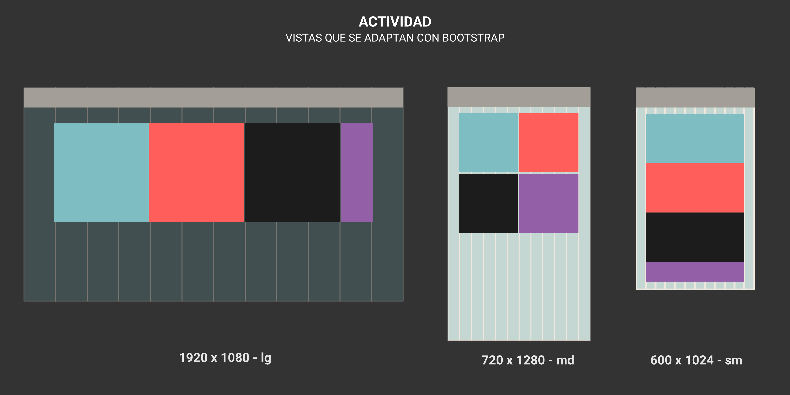

# Ejercicio 2 | Bootstrap y Git

## Enunciado

Utilizando el *framework* bootstrap, desarrollar 2 vistas pensando en pantallas de escritorio y de celulares

## Pasos para resolver el ejercicio

1. Crear una carpeta llamada vistas y crear un archivo *bootstrap.html*

2. Instalación de Bootstrap

    Existen diferentes formas de instalar bootstrap en nuestros proyectos web. Uno de lo más rápidos para comenzar a practicar es a través de CDN (archivos alojados en otras computadoras)

    Podemos utilizar los links para agreagr el CSS y Js que utilizar bootstrap en un nuevo archivo index.html

    ```html
    <!DOCTYPE html>
    <html lang="en">
    <head>
        <meta charset="UTF-8">
        <meta http-equiv="X-UA-Compatible" content="IE=edge">
        <meta name="viewport" content="width=device-width, initial-scale=1.0">
        <title>Ejercicio 2</title>
        <!-- Link de CSS bootstrap 👇👇 -->
        <link href="https://cdn.jsdelivr.net/npm/bootstrap@5.1.0/dist/css/bootstrap.min.css" rel="stylesheet" integrity="sha384-KyZXEAg3QhqLMpG8r+8fhAXLRk2vvoC2f3B09zVXn8CA5QIVfZOJ3BCsw2P0p/We" crossorigin="anonymous">
    </head>
    <body>
        <!-- Código del ejercicio desde aquí -->
        

        <!-- === Límite del código del ejercicio -->
        <!-- Link de Js bootstrap 👇👇 -->
        <script src="https://cdn.jsdelivr.net/npm/@popperjs/core@2.9.3/dist/umd/popper.min.js" integrity="sha384-eMNCOe7tC1doHpGoWe/6oMVemdAVTMs2xqW4mwXrXsW0L84Iytr2wi5v2QjrP/xp" crossorigin="anonymous"></script>
        <script src="https://cdn.jsdelivr.net/npm/bootstrap@5.1.0/dist/js/bootstrap.min.js" integrity="sha384-cn7l7gDp0eyniUwwAZgrzD06kc/tftFf19TOAs2zVinnD/C7E91j9yyk5//jjpt/" crossorigin="anonymous"></script>
    </body>
    </html>
    ```

3. Utilizando la documentación de bootstrap, antes de comenzar se debe crear un *div* con una clase *continer*. Agregar el contenedor al archivo

4. Construir una *grid* basándose en el archivo . Tomar en cuenta las 3 diferentes vistas para diferentes pantallas: sm - md - lg

5. Utilizando la página [Pexels](https://www.pexels.com) escoger una imagen para cada recuadro y hacer que respete el ancho de cada uno de ellos

6. Hacer que las imágenes sean links que redirijan a lo que se está mostrando (si la imagen es de una hamburguresa, redirigirla a una página de una hamburguesería)

7. Agregar un título que se adapte a las 3 diferentes vistas

8. Utilizar el componente de *Card* de bootstrap para agregar 4 imágenes más que se adaptaen a las 3 diferentes pantallas. Utilizar *.row* y *.col* para realizar el ejercicio